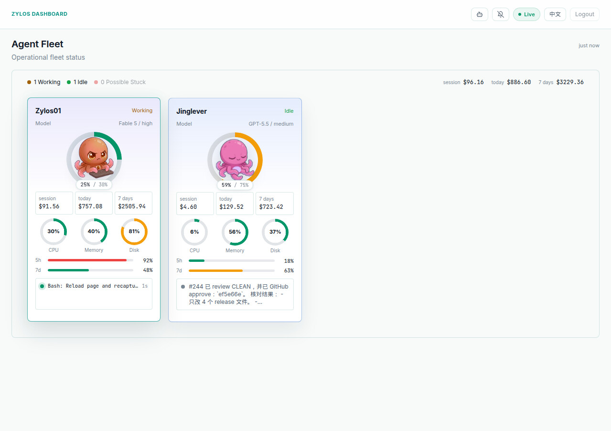
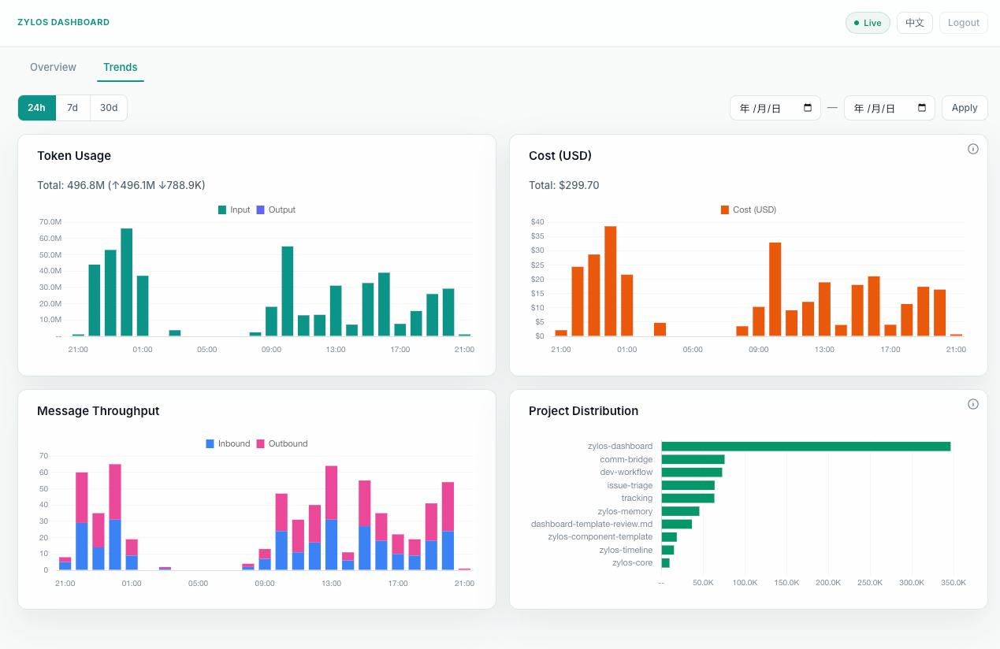

<p align="center">
  
</p>

<h1 align="center">zylos-dashboard</h1>

<p align="center">
  Provider-neutral observability with capability-first Core operations for Zylos AI agents.
</p>

<p align="center">
  <a href="./LICENSE"></a>
  <a href="https://nodejs.org/"></a>
  <a href="https://discord.gg/GS2J39EGff"></a>
  <a href="https://x.com/ZylosAI"></a>
  <a href="https://zylos.ai"></a>
  <a href="https://coco.xyz"></a>
</p>

---

<p align="center">
  
</p>
<p align="center">
  
</p>
<p align="center">
  
</p>

---

- **Real-time agent state** — idle, busy, stuck, waiting detection with tool activity feed
- **Capacity & cost tracking** — context usage, rate limits, session/daily/weekly cost
- **Actions modal** — runtime switch, model/effort change, threshold, zylos/CC upgrade
- **Full i18n** — English + Chinese with locale toggle
- **Codex compatible** — PM2, system health, communication, scheduler on all runtimes

## Install

```bash
zylos add dashboard
```

Or manually:

```bash
cd ~/zylos/.claude/skills
git clone https://github.com/zylos-ai/zylos-dashboard.git dashboard
cd dashboard && npm install
```

After install, restart the agent session to activate hooks.

## Configuration

All config lives in `~/zylos/components/dashboard/config.json`.

| Field | Default | Description |
|-------|---------|-------------|
| `port` | `3470` | Server port |
| `host` | `127.0.0.1` | Bind address |
| `ingestToken` | `null` | Bearer token for ingest API (optional defense-in-depth) |
| `auth.enabled` | `true` | Password authentication (enabled by default) |
| `auth.password` | auto-generated | Scrypt-hashed password |
| `operationsControl.enabled` | `false` | Enable the Core v1 operations control adapter |
| `operationsControl.endpoint` | — | Trusted Core bridge resource (HTTPS or loopback HTTP) |
| `operationsControl.callerNamespace` | — | Stable Core-registered caller namespace |

Operations controls are disabled until deployment supplies a versioned authorization
policy and binds an authenticated Dashboard session or service credential to a verified
external subject. Browser request bodies may provide only the action, canonical Core
target, expected aggregate version, and a redacted reason; roles, capabilities, scopes,
grants, and policy versions always come from deployment configuration and are rechecked
by Core.

```json
{
  "operationsControl": {
    "enabled": true,
    "endpoint": "http://127.0.0.1:3480/v1/operations-controls",
    "callerNamespace": "dashboard.prod",
    "authSubjects": {
      "dashboard_session": {
        "type": "user",
        "subject_id": "operator-A",
        "roles": ["observability-operator"]
      }
    },
    "authorizationPolicy": {
      "policy_id": "runtime-operations",
      "policy_version": 7,
      "state": "active",
      "grants": [
        {
          "grant_id": "grant-inspect-A",
          "subject": { "type": "user", "subject_id": "operator-A" },
          "required_role": "observability-operator",
          "capability": "runtime.inspect",
          "scope": {
            "scope_type": "conversation",
            "region": "cn",
            "tenant_id": "tenant-A",
            "bot_id": "bot-A",
            "conversation_id": "conversation-A",
            "service_instance_id": null,
            "recovery_id": null
          },
          "state": "active",
          "expires_at": null,
          "policy_version": 7
        }
      ]
    }
  }
}
```

An emergency grant additionally requires a non-null expiry plus `break_glass_reason`,
`approved_by`, and `security_audit_id`. A role such as tenant admin never creates an
implicit grant. The transport resource must inject and re-verify the trusted subject and
current policy when calling Core; Dashboard does not send transport credentials in URLs.

On first install, a random password is generated and printed to the console:

```
Dashboard password: <hex string>
Save this — it won't be shown again.
```

## Access

The dashboard is served at `/dashboard/` through the Caddy reverse proxy:

```
https://<your-host>/dashboard/
```

## Architecture

### Core runtime observability

Core publishes its public `zylos.observability-snapshot` to Dashboard's authenticated
`POST /api/runtime-snapshot` boundary. Dashboard retains only the latest validated
full replacement in memory, ordered by Core service instance and snapshot version,
and forwards a redacted presentation view through `/api/state` and SSE. It never
opens Core SQLite databases or infers Core health from process identifiers, native
provider identifiers, fleet presence, or terminal state. Partial collections remain
explicitly unavailable; they are never rendered as idle.

Authorized operators submit `zylos.control-request` v1 payloads through Dashboard's
deployment auth adapter. Dashboard validates the exact action target and mutation CAS,
preserves Core's accepted/completed/noop/conflict/forbidden/not_found/failed results,
and polls asynchronous result versions. Control authority and audit results are never
included in the Luna runtime projection.

For Luna, the existing `/api/stream?consumer=luna` seam emits a versioned
`runtime_projection` first for every accepted connection. Projection sequence is
continuous for one Dashboard instance and includes the Core instance and snapshot
version it was derived from. A partial Core snapshot is emitted to existing clients
as an explicit `complete=false` degraded projection; a new Luna connection waits
silently for a complete replacement before receiving any event.
After a Dashboard restart, the new instance ID starts its sequence at one.

```
Core public snapshot --> /api/runtime-snapshot --> validated latest snapshot
Claude Code hooks ----> hook-ingest.cjs -------> SQLite DB
StatusLine command ---> /api/ingest/statusline -> SQLite DB
System metrics --------------------------------> SQLite DB
                                                       |
                                                       v
                                              API / SSE --> Browser
```

Data flows:
- **Hook events**: Claude Code hook scripts POST to `/api/ingest` (with offline spool fallback)
- **Metrics**: the StatusLine command posts directly to Dashboard; the collector reads only the indexed latest durable metric
- **System**: PM2 and system collectors poll at intervals
- **Frontend**: SSE stream with polling fallback; i18n via JSON locale files

## Development

```bash
npm start          # Start server
npm test           # Run tests
npm run check      # Syntax check all files
npm run smoke      # Smoke test (start + verify)
```

## License

[MIT](./LICENSE)
